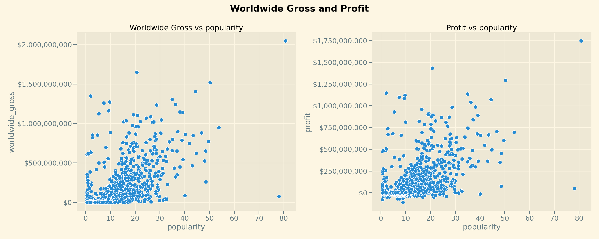

# Box Office Movie Analysis

**Authors**: Austin Towery

## Overview

This analysis focuses on how a company might start getting into making movies and which areas of the industry to focus on.  The analysis shows promising options that are not risky in which genres to focus on.  It also demonstrates some interesting data about how important audience engagement is or is not.

## Business Problem

Microsoft sees all the big companies creating original video content and they want to get in on the fun. They have decided to create a new movie studio, but they don’t know anything about creating movies. The goal of this analysis is to explore what factors can contribute to success or failure when making movies. Using that analysis I will translate those findings into actionable insights that the head of Microsoft's new movie studio can use to help decide what movies to create.
***
I picked the questions I did because I think they will provide solid advice on how to enter the industry without taking too much risk.  The benefit to this approach is that is allows for growth in the future without hurting yourself in the present.


## Data
The datasets that I use in this analysis are from IMDB, The Numbers, and The Movie DB(TMDB).  These are all websites that have a long history of providing extensive data on movies and the movie industry.  Each of these sources provide information such as gross earnings, genre, cast and crew, production and release dates, consumer ratings, and much more about millions of movies and tv shows.

The data provides an overview of how genres perform in varying metrics as well as focusing on how important audience engagement is to 
financial success.


## Methods

The goal was to compare how each genre performed financially since that felt like the logical place to start.  I looked at
metrics for worldwide gross, domestic gross, and profit.  The total and the average of each of these metrics shed light on how the 
relationship between production budget and gross earnings can point towards certain areas that are safer than others to get started
in.
***

## Results

The analysis done here sheds light on how movies in certain perform and also the basics of how long a movie should be as well as how important audience engagement is.

I am confident that this direction will provide a good footing to start off a company in a big industry like movies.

I do think that overall I would have liked to find more specific suggestions and that is something that can be done with further research and more data.
***
Here is an example of how to embed images from your sub-folder:

### Visual 1


## Conclusions

This analysis leads to 3 recommendations for getting started as a movie company:
1. Even though the highest grossing movies by far are Action and Adventure that seems like a gamble to jump in to.  So start medium or small.
2.  When we look at the profit graph it shows comedy and drama as not very far behind action and adventure.  Action and Adventure movies are usually high budget and can be time consuming because of effects/fight choreography/safety.  Focus on the next two, Comedy and Drama, projects.  These genres are typically low production budget and Comedies don't depend on stars as much as larger action and adventure movies.
3. We saw that horror actually had the highest average profit and by the same principle as above, pursuing good projects in that genre would have low production budgets.

***
Further analysis into production timelines per genre could produce even more cost effective methods of starting out.

Lastly I wanted to investigate the external revenues generated by certain genres such as action figures, toys, alternate media.  That value would be useful in the long run.
***

## For More Information

Please review our full analysis in [our Jupyter Notebook](./dsc-phase1-project-template.ipynb) or our [presentation](./DS_Project_Presentation.pdf).

For any additional questions, please contact **name & email, name & email**

## Repository Structure

Describe the structure of your repository and its contents, for example:

```
├── README.md                           <- The top-level README for reviewers of this project
├── dsc-phase1-project-template.ipynb   <- Narrative documentation of analysis in Jupyter notebook
├── DS_Project_Presentation.pdf         <- PDF version of project presentation
├── data                                <- Both sourced externally and generated from code
└── images                              <- Both sourced externally and generated from code
```
